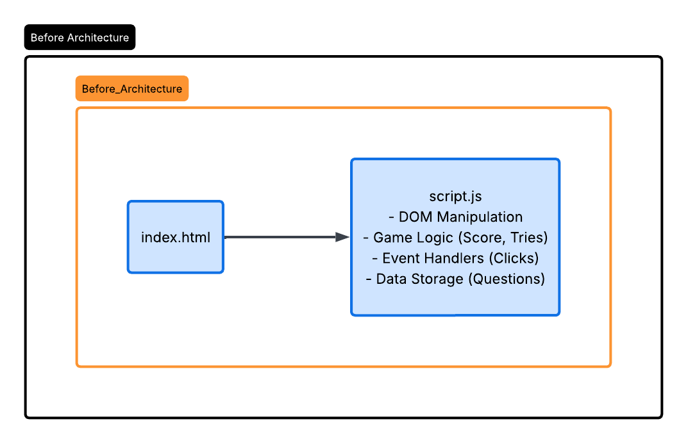
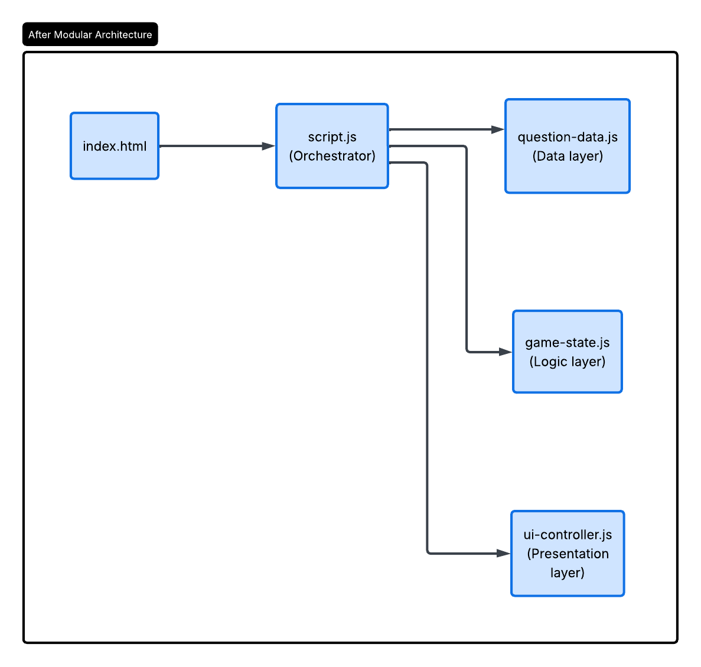

Rubic: https://stthomas.instructure.com/courses/86777/files/11732922?wrap=1

What kind of game are we making? 
Interactive Fantasy Game that incorporates quizzes and point & click aspects
With stages of difficulty

What do we hope to implement?
- DOM manipulation
- Event handling: Hint system
- Data management: Point system
- User experience design (accessibility and responsive web design)

What are our roles?
- Alex: Pixel art
- Destin: UI Design
- Ashley: Back End HTML
- James: Accessibility and Review

Updated ReadMe for Assignment 3:

TASK 1a:

Question 1: How many JavaScript files do you have? 

Answer 1: Currently the application relies on a single, monolithic JavaScript file that currently has around 100 lines of code present within it.

Question 2: What does each file do?

Answer 2: script.js acts as the sole controller for the entire application. It handles fetching DOM elements, maintaining game state variables (score, tries, current question), storing the raw data (the questions object), processing game logic (checking answers, tracking hints), and manipulating the DOM to show/hide screens and update text.

Question 3: Where are responsibilities mixed together?

Answer 3: Responsibilities are heavily entangled within script.js.
The hardcoded questions data structure is sitting in the same file as the game logic.

Functions like loadQuestion() and checkAnswer() update internal game state variables (triesLeft--, score += 2) while simultaneously updating the visual DOM (triesEl.textContent, progressBar.style.width). If we wanted to change the HTML structure, we would risk breaking the core math of the game.

BEFORE REFRACTORING ARCHITECTURE LUCID DIAGRAM:

TASK 1b:

To address the mixed responsibilities and adhere to the Single Responsibility Principle (SRP), I will split script.js into three distinct ES6 modules.

1. Module: question-data.js

Responsibility: Stores and manages the retrieval of quiz question data.

Exposed Elements: * questions (Array/Object variable)

getQuestion(difficulty, index) (Function)

2. Module: game-state.js

Responsibility: Manages the internal logic, math, and state of the current game session without ever touching the DOM.

Exposed Elements:

gameState (Class or Object holding score, tries, currentQuestion)

checkAnswerLogic(selectedAnswer, correctAnswer, usedHint) (Function)

resetGame() (Function)

3. Module: ui-controller.js

Responsibility: Handles all DOM manipulation, screen transitions, and event listener attachments.

Exposed Elements:

switchScreen(screenId) (Function)

renderQuestion(questionData) (Function)

updateScoreBoard(score, tries) (Function)

Proposal: 

Proposed Refactoring Items (Code Quality Standards):

SRP (Single Responsibility): Extract the hardcoded questions object into question-data.js so content updates don't require touching game logic.

DRY (Don't Repeat Yourself): Refactor the repetitive .classList.remove("active") and .classList.add("active") logic into a single, reusable switchScreen(screenId) function in the UI controller.

Naming Conventions: Rename ambiguous variables like q inside functions to currentQuestionData for better readability.

Error Handling: Add a fallback return in getQuestion() in case an invalid difficulty level is passed.

AFTER REFRACTORING ARCHITECTURE DIAGRAM:

TASK 2: Refactoring Implementations

Module: question-data.js

Purpose: To adhere to the Single Responsibility Principle by isolating the raw quiz content from the game logic.

Changes Made: Extracted the hardcoded questions object out of script.js. Added a getQuestion() function featuring error handling (@throws) to safely retrieve data based on difficulty and index parameters.

Module: game-state.js

Purpose: To manage the internal mathematics, scores, and tracking variables independently of the DOM.

Changes Made: Migrated score, correctAnswers, triesLeft, etc., into a unified gameState object. Extracted the checkAnswerLogic() math away from UI updates, ensuring that modifying how scores are calculated does not risk breaking visual elements.

Module: ui-controller.js

Purpose: To encapsulate reusable DOM manipulation tasks and adhere to the DRY (Don't Repeat Yourself) principle.

Changes Made: Created the switchScreen() function to replace repetitive .classList.add() and .remove() calls scattered throughout the original file.

